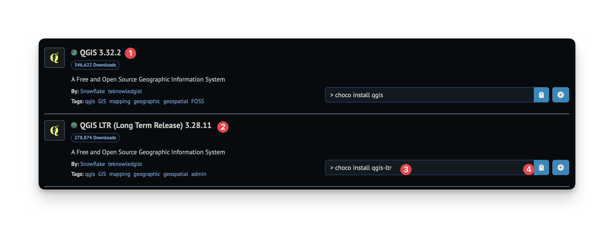
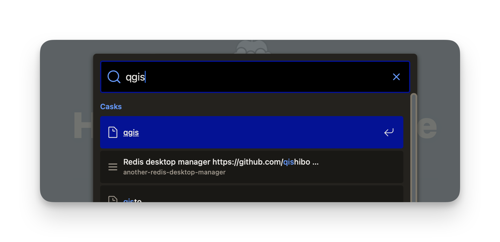
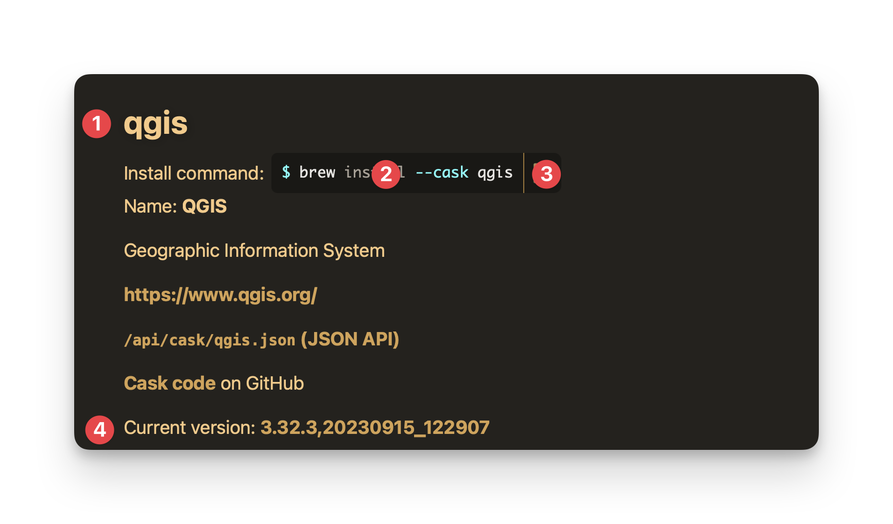
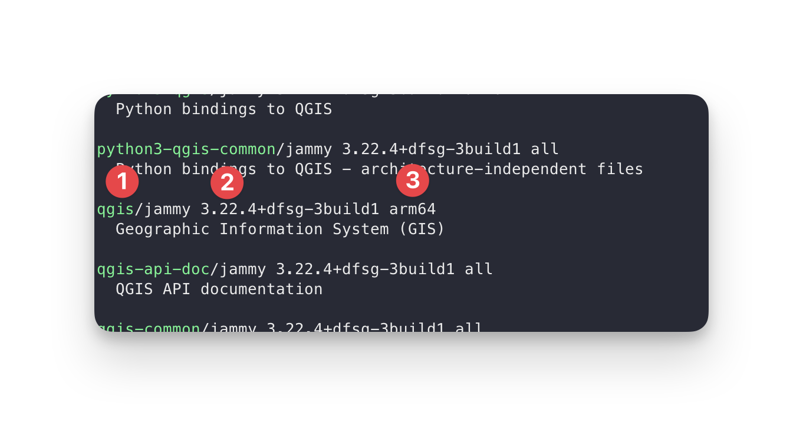

# Installing and using a package manager
<span class="tag beginner-tag">⭐️ Beginner</span> Package managers make your life easier, it's worth using from the start.

---

 A package manager is a bit like an app store with many tools for programmers. It helps install, manage, update, and delete programs and tools. We highly recommend using a package manager on your computer.

Especially on macOS and Linux, package managers are so popular that many programs recommend using a package manager as the easiest way to install their software.

??? tip "Still not convinced? Here is an (extreme) example"

    Let's say you need the C and C++ compiler `gcc` for a project.

    If we go to the [official gcc installation instructions](https://gcc.gnu.org/install/), the installation process is split up into 5 steps. These steps include a list of around 30 other pieces of software you will first need to install, and a page with more than 10.000 words about all the configuration options. Click the link above to see the installation instructions for yourself.

    With the package manager Homebrew (macOS) you can simply run
    ```bash
    brew install gcc
    ```
    And everything will be done automatically for you.

    Admittedly this is an extreme example, but in general package managers simplify the installation of software quite a bit.

Different operating systems have different package managers.

=== ":simple-windows: Windows"
    
    For Windows, we recommend the [Chocolatey package manager](https://chocolatey.org). We'll be using the free open source version.

    We recommend it over it's alternatives because of higher availability of packages, but admittedly the authors of this website do not have much experience with Windows package managers.

    The following instructions were taken from the [official Chocolatey installation guide](https://chocolatey.org/install).

    **Step 1: Open your Powershell terminal as administrator**

    Using Windows search, search for Powershell, right-click it, and open as administrator.

    **Step 2: Set execution permissions**

    Run this command in Powershell
    ```powershell
    Set-ExecutionPolicy Bypass -Scope Process
    ```
    You'll have to confirm by typing `Y` and pressing enter. This option allows us to run scripts in Powershell. (Note, in the official guide they also mention `Set-ExecutionPolicy AllSigned` but this option will not allow tools like pyenv to run.)

    **Step 3: Install Chocolatey**

    Paste the following into Powershell and press enter.
    ```powershell
    Set-ExecutionPolicy Bypass -Scope Process -Force; [System.Net.ServicePointManager]::SecurityProtocol = [System.Net.ServicePointManager]::SecurityProtocol -bor 3072; iex ((New-Object System.Net.WebClient).DownloadString('https://community.chocolatey.org/install.ps1'))
    ```
    Run into an error? Perhaps the command has been updated on the [official installation guide](https://chocolatey.org/install).

    **Chocolatey is now installed!**

    !!! tip "How to install packages using Chocolatey"
        You need to know the name of the package you're installing. Often it's the same (i.e. QGIS is `qgis`), but sometimes it's different and you need to look it up (See Where to find available packages).

        For example, if we want to install git we run
        ```powershell
        choco install git
        ```
        in Powershell. It will start printing the progress of the installation and tell you when it's done.

    ??? tip "Where to find available packages?"
        On the official [community packages page](https://community.chocolatey.org/packages) you can find the list of almost 10.000 available packages.

        

        In this example, we've searched for "qgis". The results show:

        1. The latest version of QGIS
        2. The LTR version of QGIS, a separate version that has less bugs (usually recommended by teachers).
        3. The command to install this package
        4. A copy button for the installation command

        Simply copy this command, and run it in your Powershell [terminal](terminal.md)

    !!! tip "More commands"
        Chocolatey has more commands, for things like updating and uninstalling. For these, please see the [official documentation](https://docs.chocolatey.org/en-us/choco/commands/) (specifically `info`, `uninstall`, and `upgrade`).
    
=== ":simple-apple: macOS"
    
    For macOS, we recommend the [Homebrew package manager](https://brew.sh). It's free and open source.
    
    **To install Homebrew, simply run this command in your [terminal](terminal.md) and follow the instructions.**

    ```bash
    /bin/bash -c "$(curl -fsSL https://raw.githubusercontent.com/Homebrew/install/HEAD/install.sh)"
    ```
    (This command was taken from the [official installation guide](https://brew.sh))

    It will probably tell you it needs to install the `xcode developer tools`, accept this option.

    On some Macs, Homebrew will advice you to run two extra commands after installation. Please read the last parts of the text that Homebrew printed to your terminal. It might ask you to run these commands:
    ```bash
    echo 'eval "$(/opt/homebrew/bin/brew shellenv)"' >> ~/.zprofile
    eval "$(/opt/homebrew/bin/brew shellenv)"
    ```

    **Homebrew is now installed!**

    !!! tip "How to install packages using Homebrew"
        You need to know the name of the package you're installing. Often it's the same (i.e. QGIS is `qgis`), but sometimes it's different and you need to look it up (See Where to find available packages).

        For example, if we want to install git we run
        ```powershell
        brew install git
        ```
        in your terminal. It will start printing the progress of the installation and tell you when it's done.

        Some installations have special instructions at the end.

    ??? tip "Where to find available packages?"
        On the official [Homebrew website](https://brew.sh) you can find a search bar to search all available packages.

        

        In this example, we've searched for "qgis", we see in the list the program we're looking for.

        !!! info "Casks and formulae"
            Homebrew can be used to install what they call casks and formulae. Simply said, casks are programs like Word and QGIS that have their own window. Formulae are tools that run in the terminal or in the background (like git or a compiler). If a cask and a formula have the same name, you have to add `--cask` in your installation command to install the cask, otherwise it will install the formula.

        Clicking on "qgis" in the list will give us more information.
        
        
        1.  Package name
        2.  Command to install the package
        3.  Copy button for the installation command
        4.  Version of the package you're installing.

        Simply copy this command, and run it in your [terminal](terminal.md)

    !!! tip "More commands"
        Homebrew has more commands, for things like updating and uninstalling. For these, please see the [official documentation](https://docs.brew.sh/Manpage) (specifically `info`, `uninstall`, and `upgrade`).

=== ":simple-linux: Linux"
    
    This tab is geared towards Geomatics students using Ubuntu (under [Windows Subsystem for Linux](wsl.md)). If you're using another distro, we recommend finding a package management guide specific to that distro.

    Ubuntu comes installed with the `apt` package manager. It has a huge collection of available packages.

    !!! tip "How to install packages using apt"
        You need to know the name of the package you're installing. Often it's the same (i.e. QGIS is `qgis`), but sometimes it's different and you need to look it up (See Where to find available packages).

        For example, if we want to install git we run
        ```bash
        sudo apt install git
        ```
        in your terminal. You might need to fill in your password. It will start printing the progress of the installation and tell you when it's done.

        Some installations have special instructions at the end.

    ??? tip "Where to find available packages?"
        Unlike the other operating systems' package managers, apt does not have a website to search available packages. Instead we use the `search` command.

        If we want to install qgis, we run:
        ```bash
        apt search qgis
        ```
        This will print all available packages that contain the search term.

        

        In this example, we've searched for "qgis", we see in the list the program we're looking for (1). It also shows:

        2.  The version of this package.
        3.  What architecture it's available for.

        Copy the name here, and run `sudo apt install` with that name.

    !!! tip "More commands"
        apt has more commands, for things like updating and uninstalling. For these, we recommend [this tutorial](https://linuxize.com/post/how-to-use-apt-command/).