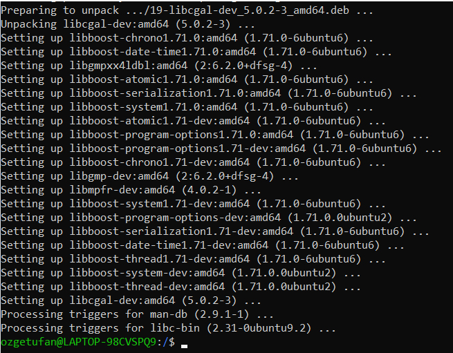
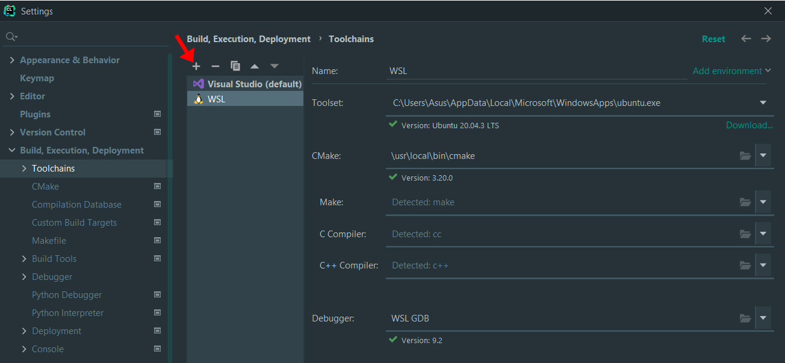
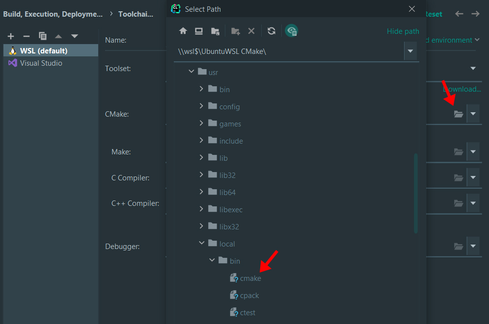
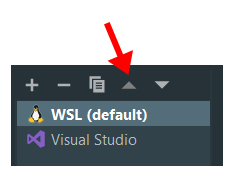

# Windows: WSL & CLion

By far the simplest way to use in C++ libraries such as [CGAL](https://www.cgal.org/) (library to perform geometric operations in 2D, 3D, and even nD), [GDAL](https://gdal.org/index.html) (library to read/write all the vector/raster formats in GIS), or others (eg [GEOS](https://libgeos.org/)), under Windows is... to install Linux!?

Installing all the libraries above is possible directly under Windows, but it is often a massive pain, so we recommend you use [WSL--Windows Subsystem for Linux](https://docs.microsoft.com/en-us/windows/wsl/), that is you install a Linux environment "inside" your Windows (Win10 or Win11), and use this.

!!! warning "Before you continue this tutorial"

    You must first [install WSL](../../computer/wsl) on your Windows machine.


## Install GDAL

To install GDAL, run the following commands one by one on your Ubuntu terminal:

```sh
sudo add-apt-repository ppa:ubuntugis/ppa && sudo apt-get update
```

```sh
sudo apt-get update
```

```sh
sudo apt-get install gdal-bin
```

```sh
sudo apt-get install libgdal-dev
```

If everything went correct, you've successfully installed GDAL!  


## Install CGAL

Let's install CGAL now with the following two commands:

```sh
sudo apt-get update
```


```sh
sudo apt-get install libcgal-dev
```



If everything went correct, you now have CGAL as well!  

!!! note

    Before starting to use GDAL and CGAL on CLion, you will need to complete the following two steps. 

## Install CMake

To install CMake, run the following commands on your Ubuntu terminal. 

Install the libraries that CMake depends on:

```sh
sudo apt-get install build-essential libssl-dev
``` 

Go to the tmp directory:

```sh
cd /tmp
```

Download the source code:

```sh
wget https://github.com/Kitware/CMake/releases/download/v3.20.0/cmake-3.20.0.tar.gz
```

When this is complete, extract the file:

```sh
tar -zxvf cmake-3.20.0.tar.gz
```

Go to the extracted folder:

```sh
cd cmake-3.20.0
```

Compile and install CMake:

```sh
./bootstrap
```

This may take some time, you should see the following when it is finished. 


Now run the following command to make it:

```sh
make
```

This step will also take some time. Once it is finished, you can finally install it:

```sh
sudo make install
```

Finally, to check if the installation was successful, you can see the CMake version:

```sh
cmake --version
```


## Install GDB
 
GDB is a debugger for C++ and you will need it in CLion to connect to WSL. 

If you are installing GDB right after CMake, you are probably still in the `cmake-3.20.0` folder on your Ubuntu terminal. First, go back to the home directory:

```sh
cd ../..
```


Install GDB with the following two commands:

```sh
sudo apt-get update
```

```sh
sudo apt-get install gdb
```

If this method does not work for you, you can also install it through the source code as explained in the second option on this [page]. 

You can verify the installation by checking the GDB version:

```sh
gdb --version
```


Once you install GDB, you now have everything you need to connect to WSL in CLion!


## Connect to CLion

!!! warning 

    The steps to connect with WSL may change depending on your CLion version. This tutorial uses CLion 2021.3.

Go to Settings from *File* or by simply pressing Ctrl+Alt+S. 


Under *Build, Execution, Deployment*, go to *Toolchains*. Then, add a new toolchain by clicking on the + sign and select WSL. 

{:width="700px"}

It should automatically detect all the fiels (Toolset, CMake, Debugger etc.). However, if you see an error for CMake that it cannot be found, click on Browse on the right-side of CMake and choose the correct file. You can find it under `/usr/local/bin/cmake`.

{:width="700px"}

After this step, you may see the following warning under C++ compiler: _Test cmake run finished with errors_.  
In this case, reboot your WSL by typing the following command on your Ubuntu terminal:  

```sh
wsl.exe -t Ubuntu
```

This will close the terminal. Simply open it again by searching Ubuntu on your device. Now, if you check CLion again, you should not see the warning anymore. 

Finally, do not forget to make WSL default by placing it on the top of the listed toolchains. You can do this by dragging WSL to the top, or by using the arrows. 




!!! success 

    Yay, you can now use GDAL and CGAL on Windows with CLion!
