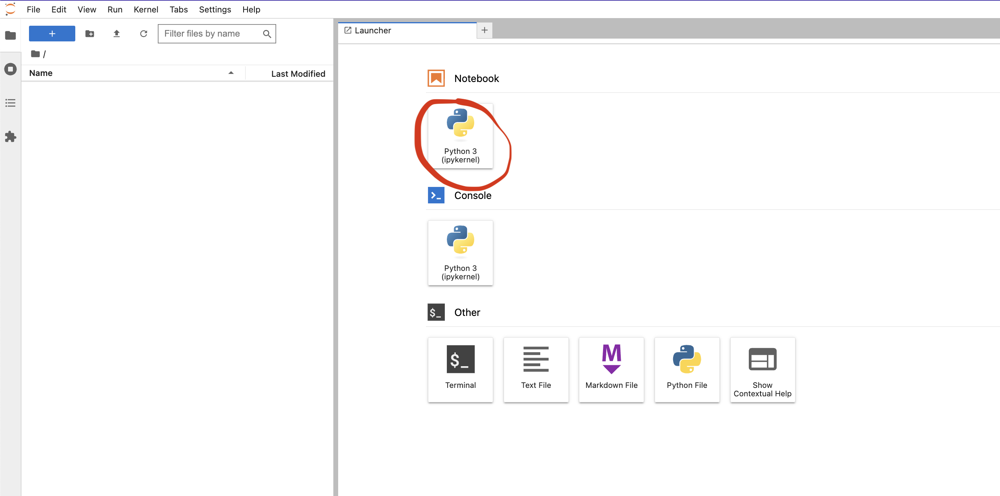

# Jupyter Lab & Notebooks

If you are working with Python, a great way to develop your code efficiently, especially when performing data analysis or creating POCs, is to use Jupyter notebooks. Here we are showing you how to do this though Jupyter lab, which is a web-based, interactive development environment that includes Jupyter notebooks. 


# How to install:

In your terminal/Powershell you can use `pip` to install Jupyter Lab.

```bash
 pip install jupyterlab
```

# How to launch:

Then you can launch the application with:

```bash
jupyter lab
```

This will start Jupyter lab on your browser. On the left panel you can navigate through your files and directories. The right panel is the Launcher from where you can start a notebook, as shown below. 



# How to work with a notebook

Within the new notebook, you can write small blocks of code in cells and run them individually by pressing `SHIFT+ENTER`. You can move cells around and collapse them, plot graphs and images and you can even add [Markdown](../../docs/writing/markdown.md) cells to document your process. 


The biggest advantage of the notebook is that you do not need to rerun parts of code that might be time-consuming or intensive (eg loading a large TIF file). Once a cell is run, its state is preserved and subsequent cells can be changed and run independently. Additionally, you can use a exclamation mark to run Bash commands (for example for installing a new python module to your environment) and a question mark to see some information about you functions an variables. 


