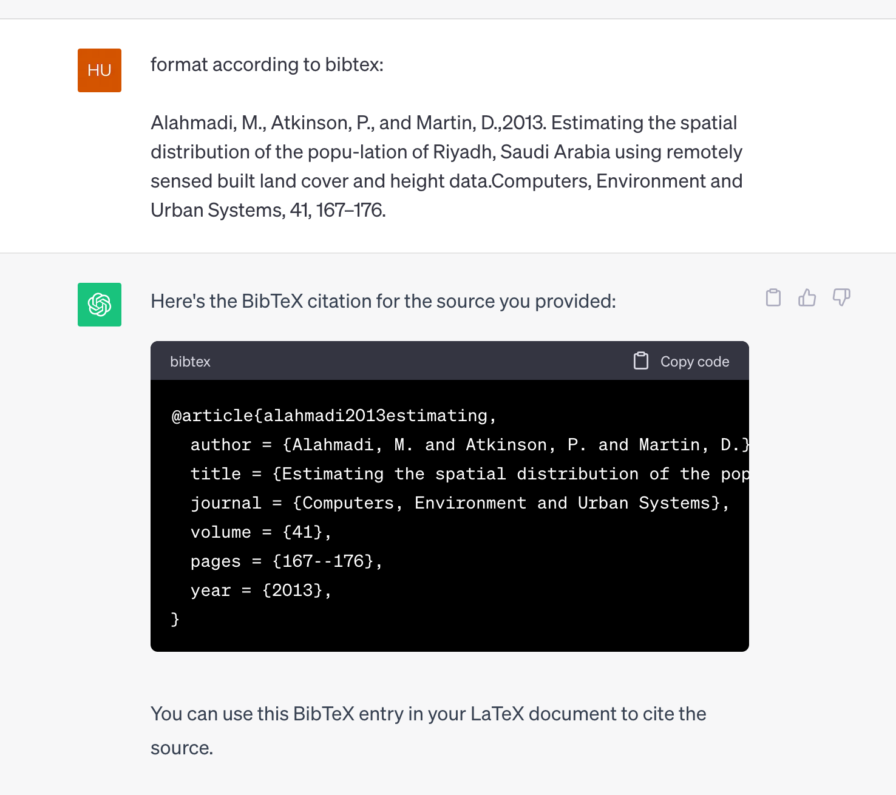

# References (BibTeX)

[BibTeX](https://en.wikipedia.org/wiki/BibTeX) is what LaTeX use, it's simple and just works.
Manually editing your `.bib` is probably a bad idea, we suggest you use a GUI that will help you create the entries and search your database.

## Software to manage references

  - [JabRef](http://jabref.sourceforge.net) :material-open-source-initiative: :simple-linux: :simple-apple: :simple-windows:
  - [Zotero](https://www.zotero.org/) :material-web: (integrations for Office and browsers; use a plugin like [better bibtex](https://retorque.re/zotero-better-bibtex/))
  - [Mendeley](https://www.mendeley.com/) :simple-linux: :simple-apple: :simple-windows: (integrations for Office and browsers; integrates with Overleaf professional accounts)
  - [BibDesk](https://bibdesk.sourceforge.io) :material-open-source-initiative:  :simple-apple:

## How to obtain well-formatted BibTeX entries 

!!! tip "Tip #1: Paste a DOI"

    With BibDesk (and probably others) you can simply copy the [DOI](https://www.scribbr.com/citing-sources/what-is-a-doi/) and a new entry nicely formatted will be created (might need minimal manual work).

!!! tip "Tip #2: Use www.doi2bib.org"

    You could alternatively use [www.doi2bib.org](https://www.doi2bib.org) to obtain nicely formatted BibTeX entries.

!!! tip "Tip #3: Use ChatGPT"

    ChatGPT can also take the text of a reference in a PDF and BibTeX format it, see a simple example:

    